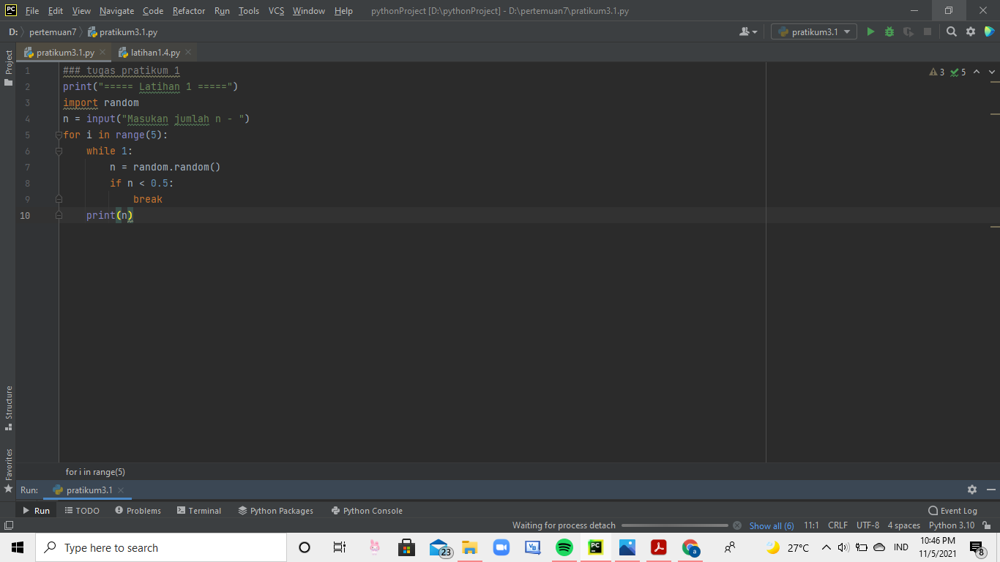
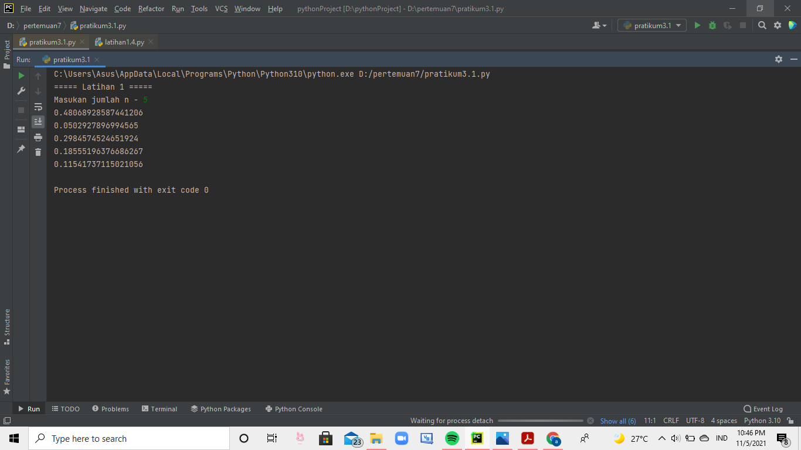
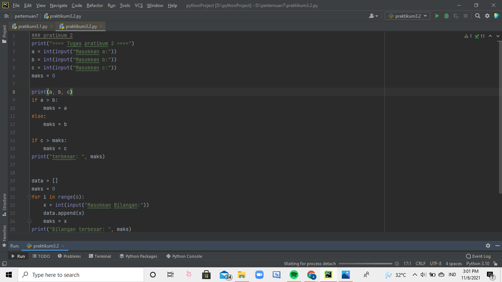
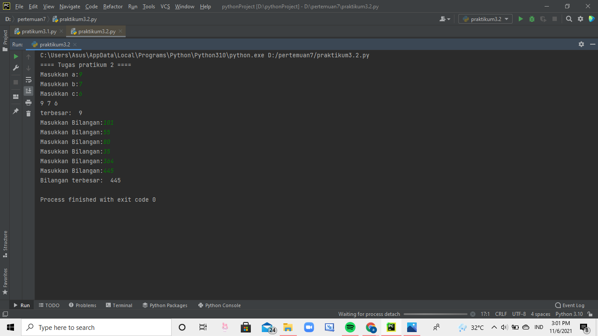
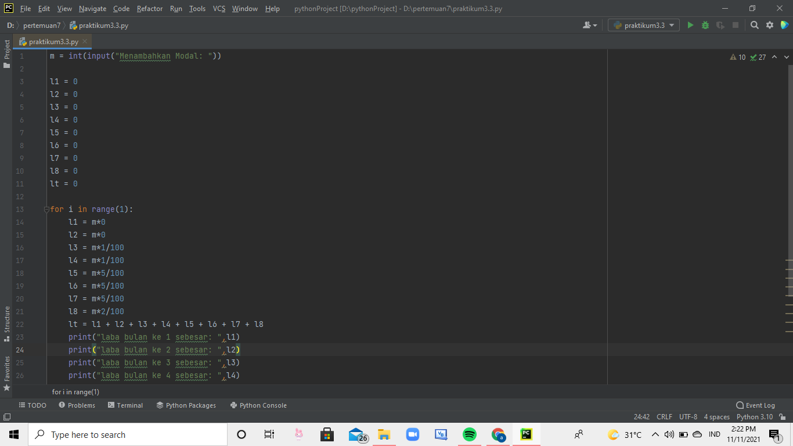
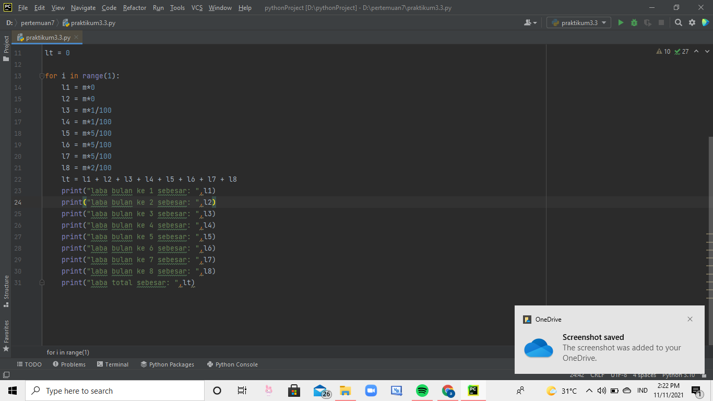
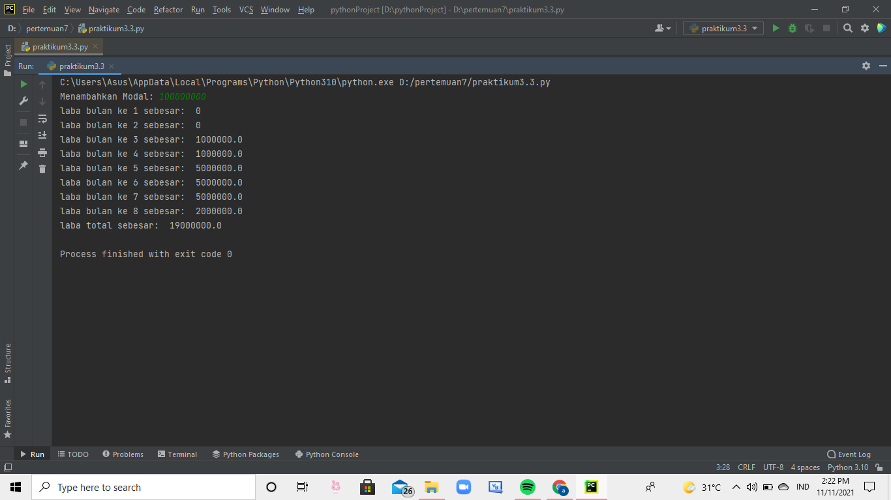

# labspy003

## latihan keenam 
ketik import lalu input, masukan kode while dan if, lalu ketik break, dan print 

dan di run 

## latihan ketujuh 
masukan input, ketik kode if dan else. print terbesarnya, lalu ketik for i in range dan print terbesarnya. 

dan di run 

## latihan kedelapan 
masukan input dan bilangan modalnya 

lalu ketik for i in range 

lalu di print, dan di run 

hasilnya jadi seperti ini 

